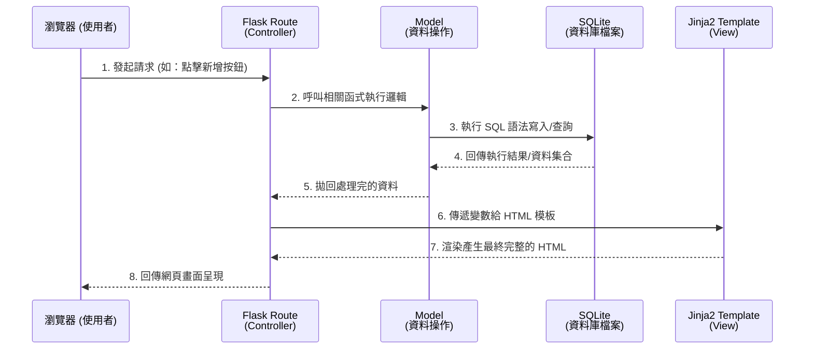

# 系統架構設計 (ARCHITECTURE) - 任務管理系統

## 1. 技術架構說明

本專案採用輕量級的 Python Web 框架 Flask 作為核心，並搭配以下技術來建構整個系統：

*   **後端框架**：**Flask**。選用 Flask 是因為它非常輕巧且具備高彈性，十分適合快速開發這種規模明確、功能聚焦的個人管理系統。
*   **模板引擎**：**Jinja2**。本專案未採用「前後端分離」架構，而是讓 Flask 從資料庫拿取資料後，交由 Jinja2 在伺服器端將資料與 HTML 結合，渲染成完整的網頁再回傳給瀏覽器 (SSR, Server-Side Rendering)。
*   **資料庫**：**SQLite**。為了輕量化與免去伺服器建置的麻煩，我們採用基於檔案的關聯性資料庫 SQLite（將透過 Python 內建的 `sqlite3` 模組或輕量級 ORM 來操作），專注於儲存所有的任務資料。

### Flask MVC 模式說明
雖然標準 Flask 架構並沒有強制規範 MVC 結構，但為了程式碼易於維護，我們會以類似 MVC (Model-View-Controller) 的概念來設計：
*   **Model (模型)**：負責定義資料庫的資料表結構，以及所有單純和資料庫溝通的邏輯（如：讀取列表、新增、刪除、標記任務）。
*   **View (視圖)**：負責最終呈現給使用者的介面。在這裡指的是搭配 Jinja2 語法的 HTML 模板，用來把資料渲染為網頁畫面。
*   **Controller (控制器)**：負責接聽與處理瀏覽器發送的 HTTP 請求。在 Flask 裡對應的就是「路由 (Routes)」。它會負責呼叫 Model 以存取資料，接著將取得的資料轉交給 View 產生網頁，最後將網頁回應給使用者。

---

## 2. 專案資料夾結構

為保有未來的維護性，建議將專案拆分成以下結構：

```text
D1445595-4-16/
├── app/                      # 應用程式主要資料夾
│   ├── models/               # Model：資料庫模型與操作邏輯
│   │   └── task.py           # 負責任務的建立、查詢、修改與刪除 (CRUD)
│   ├── routes/               # Controller：Flask 路由處理邏輯
│   │   └── task_routes.py    # 定義不同的 URL 路徑對應的功能 (如 /add, /delete)
│   ├── templates/            # View：Jinja2 HTML 模板
│   │   └── index.html        # 最主體的網頁 (包含列表與新增表單)
│   └── static/               # 用來存放 CSS、JavaScript 等靜態資源檔案
│       ├── css/
│       │   └── style.css     # UI 樣式設計
│       └── js/               # 前端腳本 (視需求存放微互動邏輯)
├── instance/                 # 放運行時產出的檔案、敏感設定
│   └── database.db           # SQLite 本機資料庫檔案 (自動在此生成)
├── docs/                     # 專案文件存放處
│   ├── PRD.md                # 產品需求文件
│   └── ARCHITECTURE.md       # 系統架構設計文件 (本文件)
├── requirements.txt          # Python 依賴套件表
└── app.py                    # 系統進入點 (啟動 Flask 伺服器的主要檔案)
```

---

## 3. 元件關係圖

以下透過圖表展示當使用者在系統上操作時，各系統元件在背後的互動流程：



---

## 4. 關鍵設計決策

1.  **採用 SSR 不做前後端分離**
    *   **原因**：目前的 MVP 功能專注於「紀錄與狀態追蹤」，功能量級較小。採用 Server-Side Rendering 可以降低初期的開發負擔，不必設計繁複的 REST API、或處理前端 (如 React / Vue) 各種打包/跨域問題，直接由 Flask 一手包辦能加快開發速度。
2.  **不建置大型資料庫伺服器，改用 SQLite**
    *   **原因**：因為是針對個人用戶提供的極簡工具，不會有大量多併發存取的效能瓶頸。SQLite 不需開啟背景服務，單一 `.db` 檔案儲存的特性更方便我們在開發測試階端隨時重製，未來部署也最沒有阻礙。
3.  **依 MVC 模式預先拆分 Models 與 Routes**
    *   **原因**：如果將所有的路由和資料庫 `execute` 邏輯全都直接塞在 `app.py` 中，檔案將會快速變得龐大且難以閱讀。預先規範好各自的職責與資料夾，能讓未來要增加「身分驗證 / 註冊系統」時，具備良好的擴充空間。
