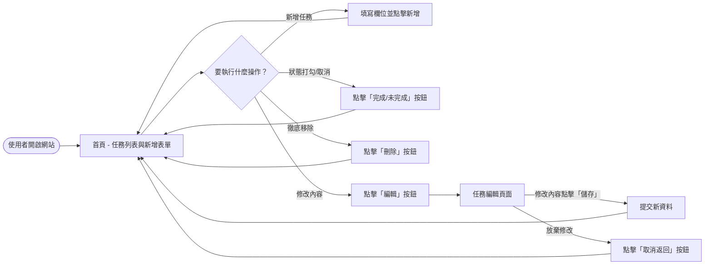
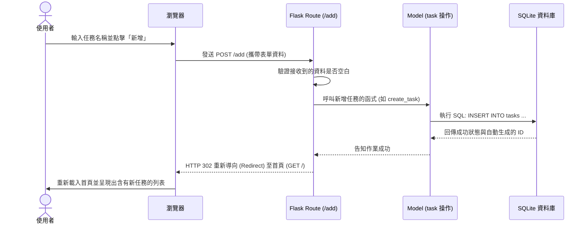

# 流程圖設計 (FLOWCHART) - 任務管理系統

基於產品需求文件 (PRD) 與系統架構設計，以下詳細描繪使用者的操作路徑與系統內部的資料流動。

## 1. 使用者流程圖 (User Flow)

這張圖展示了使用者進入系統後，可以進行的各項主要操作與實體的畫面跳轉路徑。所有的主要操作最終都會自動重導向回首頁，確保使用者能持續看到最新的任務狀態。

## 2. 系統序列圖 (Sequence Diagram)

以下特別針對「新增任務」這項核心功能繪製序列圖，描述使用者送出表單後，在系統內部（瀏覽器到資料庫之間）發生的各種操作流程。

## 3. 功能清單與對應路由表 (Route Mapping)

為了讓之後撰寫 Controller (Flask Routes) 與 View (Jinja2 Templates) 有明確的依據，以下列出系統將包含的網址路由對照表。

| 功能項目 | URL 路徑 | HTTP 方法 | 說明 |
| :--- | :--- | :--- | :--- |
| **首頁與清單** | `/` | `GET` | 系統入口，載入完整的待辦/已完成任務列表，並在上方顯示新增表單。 |
| **建立新任務** | `/add` | `POST` | 接收首頁表單送出的任務內容，於資料庫建立後重新導回 `/` 首頁。 |
| **切換任務狀態** | `/toggle/<int:task_id>` | `POST` | 根據傳入的 `task_id` 反轉該筆任務的「已完成/未完成」狀態，完成後導回首頁。 |
| **進入編輯模式** | `/edit/<int:task_id>` | `GET` | 從資料庫提取該筆任務目前的資料，回傳一份獨立的任務編輯頁面。 |
| **儲存編輯結果** | `/edit/<int:task_id>` | `POST` | 接收編輯表單送出的新資料，將原有的任務內容覆寫，完成後導回首頁。 |
| **刪除任務** | `/delete/<int:task_id>` | `POST` | 根據傳入的 `task_id`，將該筆資料從資料庫刪除，作業完成後導回首頁。 |

> **開發小提醒：** 基於網頁資安實務，會修改伺服器資料的操作（例如：刪除、變更狀態）都會設計為 `POST` 請求，而非隨時可能被預先載入或機器人觸發到的 `GET` 請求。
